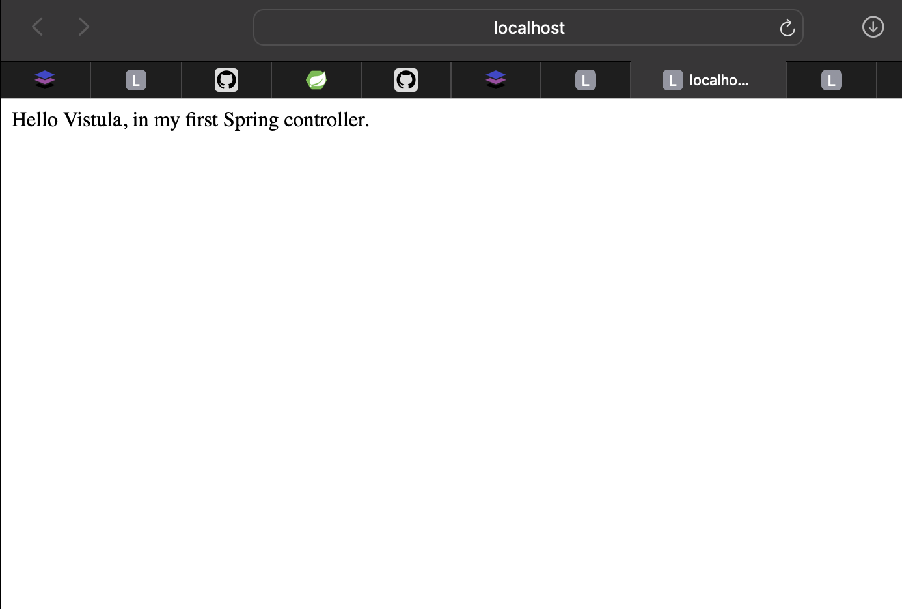
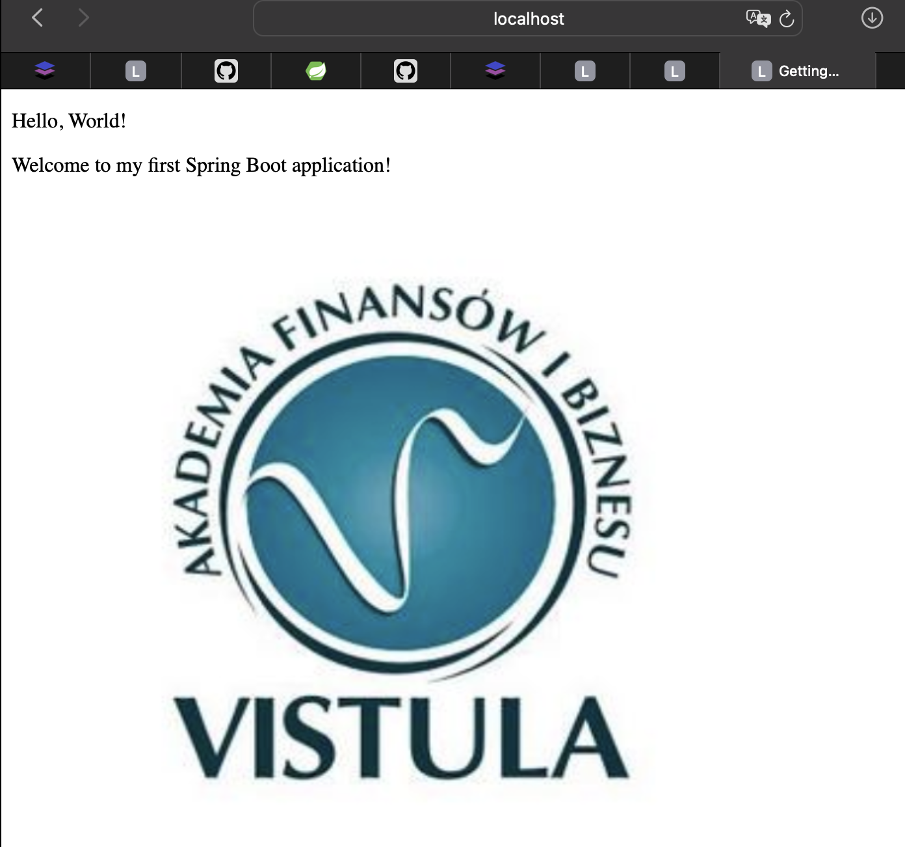

# TASK 1 - SIMPLE SPRING CONTROLLER
This is a basic Spring Boot Controller with Index Page And Greeting Page.

____

## FEATURES
- <mark>'/'</mark> (index)
- <mark>'/greeting'</mark>

____

## DEPENDENCIES USED
- Thymeleaf
- Spring Web
- Lombok

____

## PROJECT STRUCTURE
```
src/
 ├── main/
 |    ├── java/
 |    │    ├── com.example.First_Spring_Project_Java/
 |    |    |     └──FirstProjectJavaSpringApplication.java  
 |    │    └── controller/
 |    │              └── HelloController.java
 |    │
 |    └── resources/
 |         ├── static.images/
 |        |     └── logo.jpg
 |        |
 |       ├── templates/
 |       │     └── greeting.html
 |      │
 |         └── application.properties
 |
 └── test/
      └── java/
            └── com.example.First_Spring_Project_Java
                   └── FirstProjectJavaSpringApplicationTests.java

```

___

## CONTROLLER CODE

```

@Controller
public class HelloController {


    @GetMapping("/")
    @ResponseBody
    public String hello() {
        return "Hello Vistula, in my first Spring controller.";
    }


    @GetMapping("/greeting")
    public String greeting(
            @RequestParam(name = "name", required = false, defaultValue = "World")
            String name,
            Model model) {
        model.addAttribute("name", name);
        return "greeting";
    }
}


```

___

## INDEX PAGE (<mark>/</mark>)

- URL: <mark>http://localhost:8080/</mark>
- METHOD: <mark>hello()</mark>
- When <mark>/</mark> is opened, the <mark>hello()</mark> method runs
- It returns a <mark>String</mark>



___

## GREETING PAGE (<mark>/greeting</mark>)

- URL: <mark>http://localhost:8080/greeting?name=Seturaj</mark>
- Takes the NAME from the URL
- Save it in the model
- Returns "greeting"
- Then Spring looks for templates/greeting.html



____
